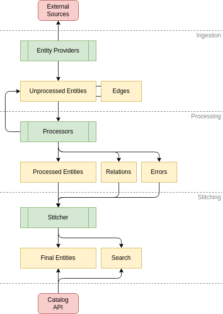

* entity types
* metadata
* reactive event handling
* building a custom homepage
* building a custom plugin
* notifications by entity or broadcast (or custom segments)
* authorization
    * can create custom permission policies
* [native otel](https://backstage.io/docs/tutorials/setup-opentelemetry)
* catalog
    * can extend through entity providers to ingest data
        * show manual registration with github, manual entry, github discovery, and api registration
        * providers handle discovering updates for Locations
    * can extend with custom processors to validate, analyze, and transform entities
        * show location entity
        * annotations allow for integration (with sonarqube, secops, cmdb, etc)
        * 
    * can add validation policies
    * search
        * can use Elasic and Postgres natively or a custom engine
        * custom search api can also include reaching out to internal resources
    * extending the model (new types of existing kinds, metadata, labels, relations, annotations, and entire entities)
    * [entity model ](https://backstage.io/docs/features/software-catalog/system-model)
    * [api](https://backstage.io/docs/features/software-catalog/software-catalog-api)
* templates (create components that don't exist yet)
    * can create do github things, see logged-in user details, make api calls, interact with Azure, publish MSTeams messages, etc
    * can create custom actions and step layouts
    * has outputs
    * has a dry run flag
    * built in template editor (but hosted in github)
    * feels very similar to github actions
* techdocs
    * process
        * markdown sourced from github file url (or custom location)
        * generates html files (configurable build step)
        * transformers allow rewriting html
        * stores html files (to read from as a cache)
    * write and preview docs through techdocs-cli
    * can use addons (to add plantuml, mermaid, iframes, etc)
    * can use hybrid build strategy (some repos build and upload docs with github actions, some will be built by techdocs)

* plugins to configure for demo
    * kubernetes
    * software catalog
    * software templates
    * [techdocs](https://demo.backstage.io/catalog/default/component/backstage/docs/getting-started/)
    * search
    * [adrs](https://github.com/backstage/community-plugins/raw/main/workspaces/adr/plugins/adr/docs/adr-tab.png)
    * tech radar (show local instance)
    * api-docs (show Spotify instance)
    * [feedback](https://github.com/drodil/backstage-plugin-qeta) or [msforms](https://github.com/zcmander/backstage-plugin-msforms/blob/main/docs/images/entity_page.png?raw=true)
    * [snyk](https://github.com/snyk-tech-services/backstage-plugin-snyk/raw/main/docs/assets/backstage-snyk-plugin-tab.png)
    * [sonarqube](https://github.com/backstage/community-plugins/raw/main/workspaces/sonarqube/plugins/sonarqube/docs/sonar-card.png)
* nice to have plugins
    * Jira or [jira-dashboard](https://github.com/AxisCommunications/backstage-plugins/raw/main/plugins/jira-dashboard/media/overview.png)
    * changelog
    * costinsights
    * api spectral linting
    * artifactory artifacts (there's a few plugin options)
    * score-card
    * toolbox (avro)